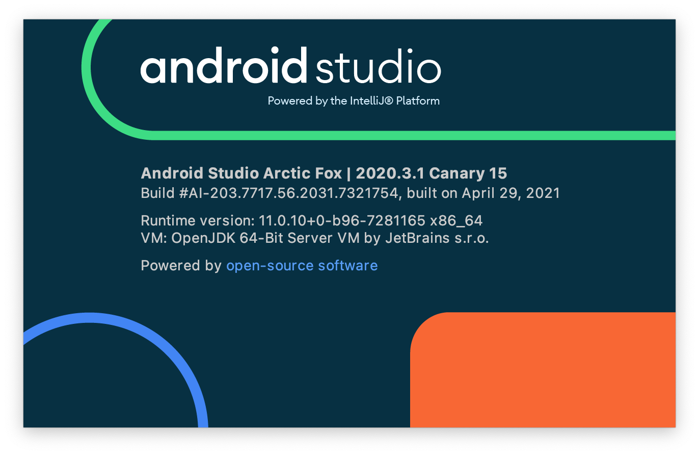
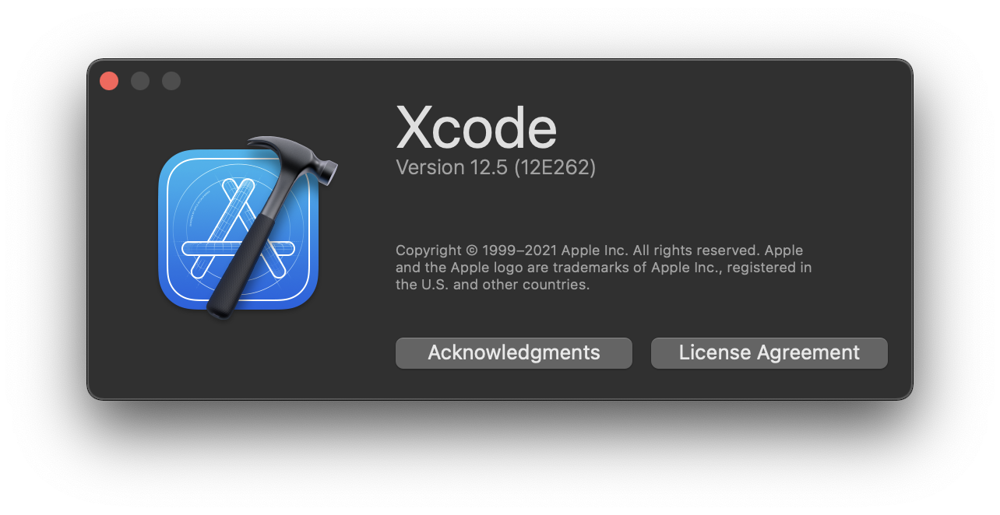
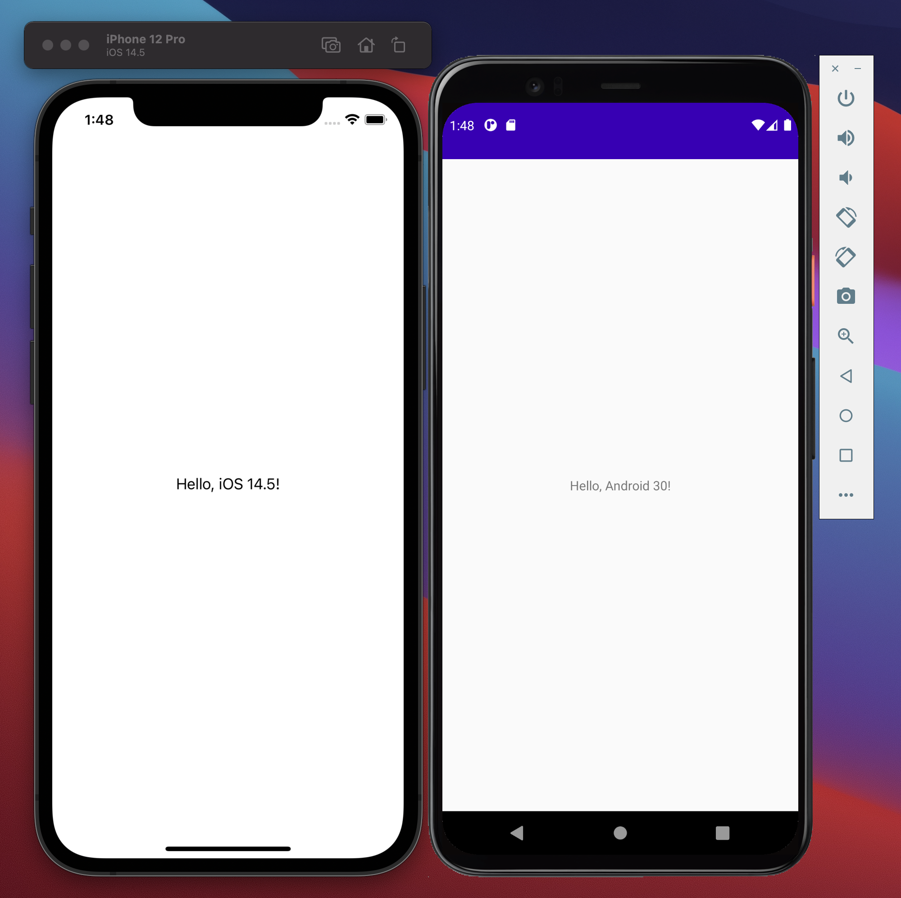

# KMMSample
## Environment

## Screenshots

## Reference
* [KMM documentation](https://kotlinlang.org/docs/mobile/home.html)
* [Kotlin Multiplatform Mobile がアルファ段階に移行](https://blog.jetbrains.com/ja/kotlin/2020/09/kotlin-multiplatform-mobile-goes-alpha-ja/)
* [KMMサンプル作ってみた](https://qiita.com/tomotakasg/items/19be0038b8933fbf751b)
* [Kotlin Multiplatform Mobile (KMM) ことはじめ 〜Hello, World!〜](https://asmz.hatenablog.jp/entry/kotlin-multiplatform-mobile-getting-started)
* [KMM(Kotlin Multiplatform Mobile) の開発環境をセットアップする](https://zenn.dev/xxminamixx/articles/21bec0b15e5c29)
* [Kotlin Multiplatform Mobile を使ってiOS・Androidの処理を共通化する](https://qiita.com/hryk224/items/ba41d6ff2651f17c95e1)